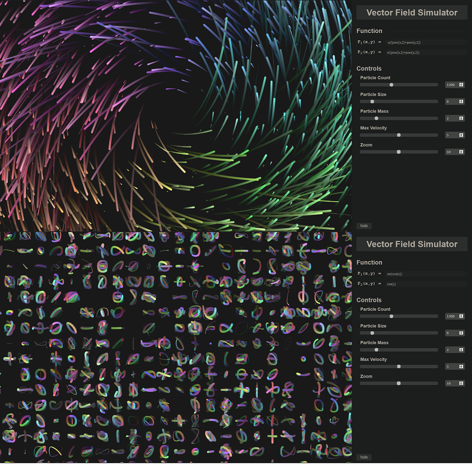
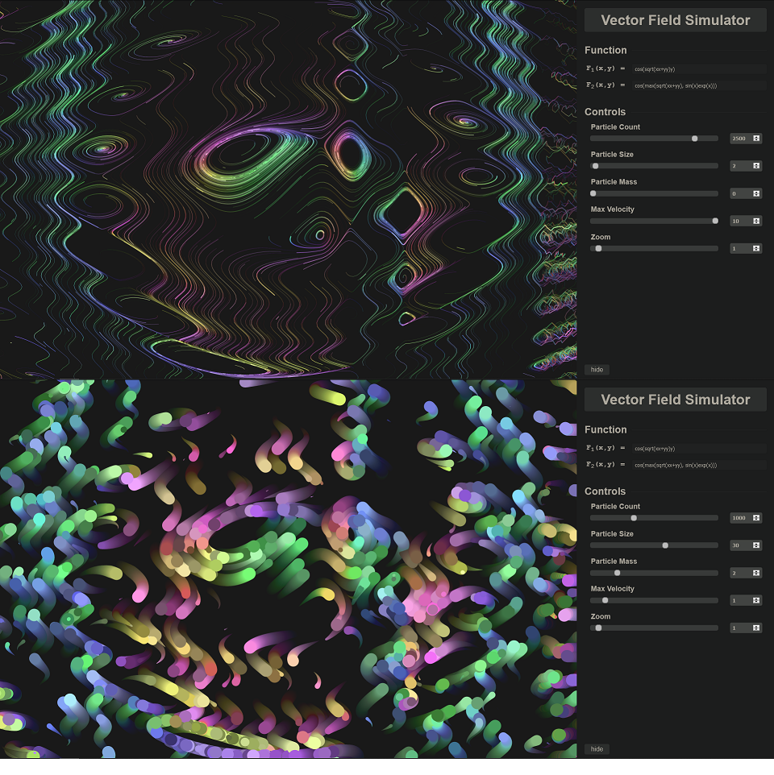

# Vector Field Simulation
## Table of Contents
* [General info](#general-info)
* [Try it out](#try-it-out)
* [Features](#features)
* [How it works](#how-it-works)

## General info
A simple, web-based vector field visualization which demonstrates the flow direction of arbitrary vector fields using colored particles rendered using p5.js.

## Try it out
[https://kananb.github.io/Vector-Field-Simulation](https://kananb.github.io/Vector-Field-Simulation)

## Features
### Vector function parsing

### Particle configuration

### Environment scaling

### Full screen mode

## How it works
#### Particle Simulation
The particles are managed by a FlowField object which also keeps track of the width and height of the viewable area, coordinate scale factor, vector function,
and global particle attributes such as size and mass. Additionally, each particle stores some information about itself. Namely, its current position, previous position,
velocity, age, lifespan, current size, and color.

The age, lifespan, and current size allow the particle to fade out and be repositioned so that particles don't layer on top of each other too much.

Every frame, the vectors corresponding to each particle's current position is calculated and added to their velocity which is then added to their position. During these
calculations, the particle's mass and maximum velocity are taken into account to allow for a variety of movement configurations and simulation results.

#### Particle Configuration
Each slider and input pair corresponds to an attribute stored in the FlowField class. When a slider or input is changed, the corresponding attribute in the FlowField object is
updated to match the entered value.

#### Function parsing
Upon changing either of the function input fields, the entered function is tokenized using a [lexer](https://github.com/aaditmshah/lexer). The tokens are then parsed into a
valid JavaScript expression which gets evaluated in the context of a function. It is important to note that the inputs used to generate the JavaScript vector function are not
sanitized and are a possible attack vector for malicious users. As such, this code should not be used or reproduced in environments or products which require any amount
of data security or integrity.

#### [back to the top](#vector-field-simulation)
